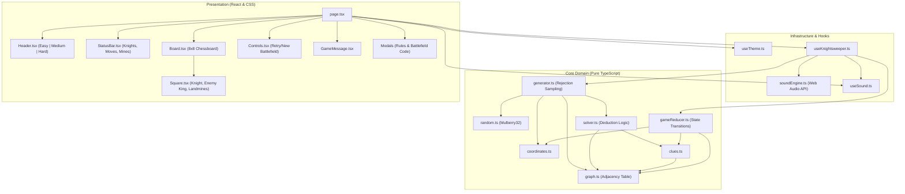
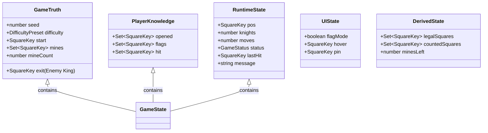
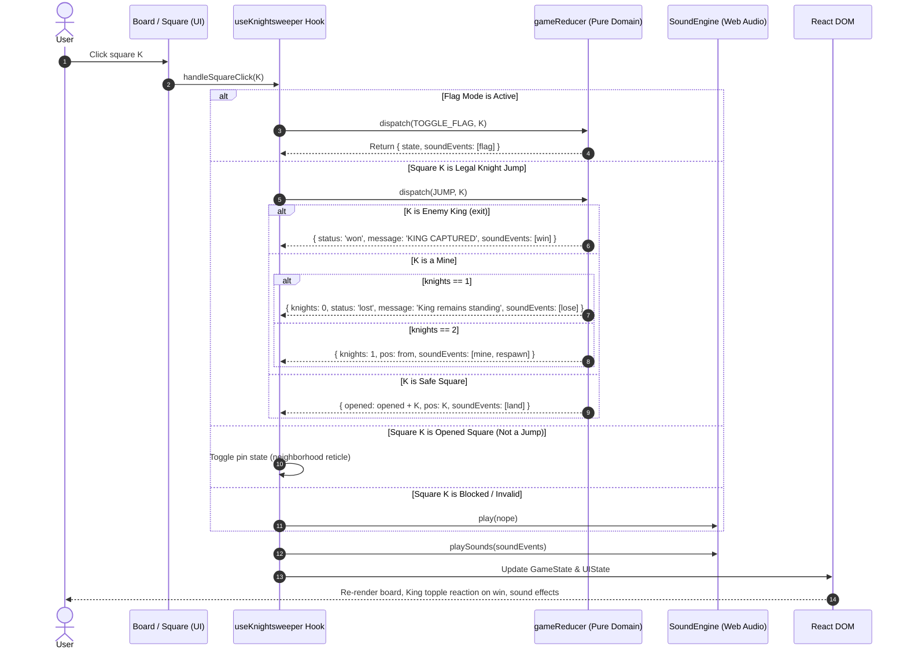
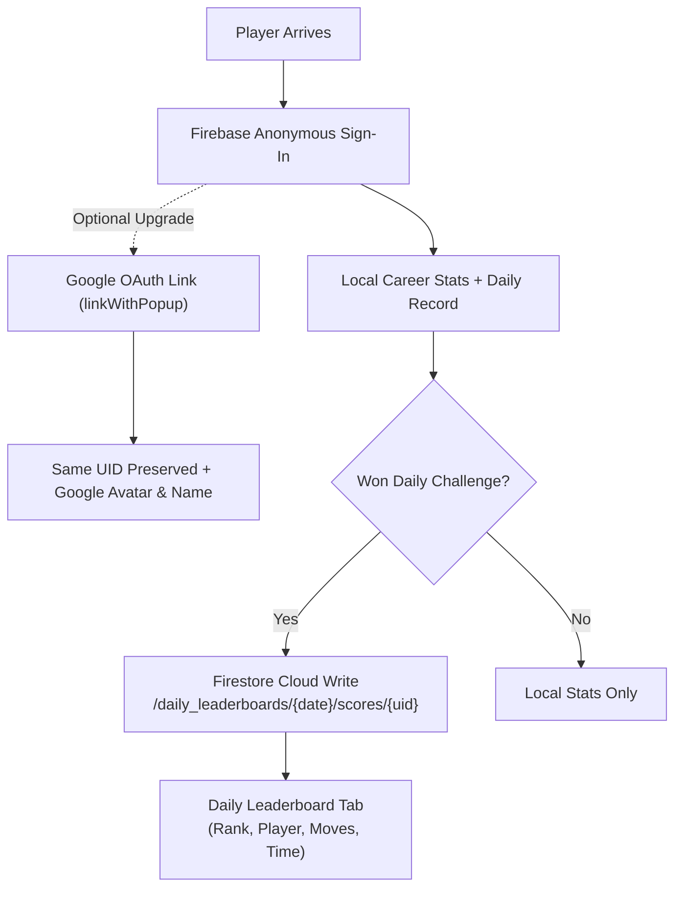

# Knightsweeper: Software Architecture & System Design

This document details the system architecture, component boundaries, state models, data flows, and design principles of **Knightsweeper (Chess Battlefield Edition)**.

---

## 1. Architectural Overview

Knightsweeper follows a strict **Unidirectional Data Flow (UDF)** and clean separation of concerns, dividing the application into three decoupled layers:
1. **Core Domain Layer (`src/core/`):** Pure TypeScript mathematical models, graph topology, deterministic algorithms, solver, and state transition functions. 100% free of React, DOM, or audio APIs.
2. **Audio & Infrastructure Layer (`src/audio/`, `src/hooks/`):** Reactive adapters, Web Audio API synthesis engine, and custom React hooks managing lifecycle, storage, and audio event dispatching.
3. **Presentation Layer (`src/components/`, `src/app/`):** React components, responsive CSS grid layout, accessible ARIA announcements, and chess battlefield styling.



---

## 2. Terminology Mapping: Implementation vs. Player-Facing

To preserve technical integrity while providing an intuitive player experience, Knightsweeper maintains a strict mapping between internal implementation variables and player-facing terminology:

| Implementation Concept | Player-Facing Representation | Description |
| --- | --- | --- |
| `seed: number` | **Battlefield #<number>** | 32-bit deterministic PRNG seed displayed as a memorable battlefield code (e.g. `#42817`). |
| `exit: SquareKey` | **Enemy King ($\text{♔}$)** | Target destination on ranks 7..8. Capturing the King triggers victory. |
| `mines: Set<SquareKey>` | **Landmines** | Hidden explosive hazards one knight jump away. Detonating leaves scorch marks. |
| `difficulty: 'easy'\|'medium'\|'hard'` | **Easy (8) \| Medium (16) \| Hard (24)** | Mine density presets (Medium default: 25% density). Part of deterministic board reproduction. |
| `INITIALIZE_GAME` (new seed) | **New Battlefield** | Generates a fresh reproducible battlefield. |
| `INITIALIZE_GAME` (same seed & diff) | **Retry Battlefield** | Replays the exact identical layout from the start. |

---

## 3. Directory Structure & Module Responsibilities

```
knightsweeper/
├── docs/                                # Technical documentation & learning resources
│   ├── ARCHITECTURE.md                  # System architecture & Mermaid specifications
│   ├── ENGINEERING-JOURNAL.md           # Decisions, rationale, tradeoffs, and lessons
│   ├── LEARNING-GUIDE.md                # Computer science textbook-style guide
│   ├── TESTING.md                       # Product management verification & test report
│   └── requirements/                    # Product specifications & planning document
│       └── Knightsweeper Game Requirements.md
├── src/
│   ├── app/                             # Next.js App Router root
│   │   ├── globals.css                  # Chess battlefield design system & CSS variables
│   │   ├── layout.tsx                   # HTML shell, fonts & metadata
│   │   └── page.tsx                     # Main interactive game page
│   ├── audio/
│   │   └── soundEngine.ts               # Web Audio API procedural synthesis
│   ├── components/                      # React UI components
│   │   ├── AmbientBackground.tsx        # Subtle vignette spotlight & ambient lighting
│   │   ├── Board.tsx                    # Elevated chessboard tray & coordinate axes
│   │   ├── Controls.tsx                 # Mode toggles, actions, and settings
│   │   ├── GameMessage.tsx              # Narrative log with aria-live polite
│   │   ├── Header.tsx                   # Title, segmented difficulty, battlefield code
│   │   ├── HowToPlayModal.tsx           # Rules, tips, and mechanics modal
│   │   ├── SeedModal.tsx                # Battlefield Code inspection and input
│   │   ├── Square.tsx                   # Knight, Enemy King, Landmines, Clues
│   │   └── StatusBar.tsx                # Lives, moves, and remaining mines
│   ├── core/                            # Framework-agnostic domain logic
│   │   ├── clues.ts                     # Clue calculation & neighborhood queries
│   │   ├── constants.ts                 # Board dimension, jump vectors, presets
│   │   ├── coordinates.ts               # 1D index conversion & algebraic notation
│   │   ├── gameReducer.ts               # Pure state machine reducer
│   │   ├── generator.ts                 # Procedural battlefield generation pipeline
│   │   ├── graph.ts                     # Knight movement adjacency table & BFS
│   │   ├── random.ts                    # Mulberry32 PRNG & Fisher-Yates shuffle
│   │   ├── solver.ts                    # Single-clue deduction solver
│   │   └── types.ts                     # Domain TypeScript interfaces & types
│   └── hooks/                           # React lifecycle & state hooks
│       ├── useAmbience.ts               # Ambient background toggle & persistence
│       ├── useKnightsweeper.ts          # Main game orchestrator hook
│       ├── useSound.ts                  # Audio toggle & dispatch hook
│       └── useTheme.ts                  # Light / Dark theme persistence hook
└── tests/                               # Automated unit test suite (Vitest)
    ├── clues.test.ts
    ├── coordinates.test.ts
    ├── gameReducer.test.ts
    ├── generator.test.ts
    ├── graph.test.ts
    ├── random.test.ts
    └── solver.test.ts
```

---

## 4. State Architecture: Truth vs. Player Knowledge vs. UI

The state model strictly isolates what the game secretly knows, what the player has uncovered, and temporary UI interactions:



### 1. Game Truth (Secret Ground Truth)
- `mines`: Set of square keys containing landmines. Never visible to player until game over or mine detonation.
- `start`, `exit`: Immutable positions for the current battlefield seed (exit represents the stationary enemy King).
- `difficulty`: Selected difficulty preset (`easy` = 8, `medium` = 16, `hard` = 24).
- `mineCount`: Total active mines on the battlefield.

### 2. Player Knowledge (Fog of War)
- `opened`: Squares the knight has landed on. Safe by definition. Shows clue numbers.
- `flags`: Squares marked by the player as suspected mines. Blocks movement.
- `hit`: Mines detonated by the player. Rendered as permanently disabled landmines with scorch marks.

### 3. Runtime & Progress State
- `pos`: Current square key occupied by the active knight piece.
- `knights`: Number of lives remaining (2 down to 0).
- `moves`: Total jump counter.
- `status`: `'playing' | 'won' | 'lost'`.
- `message`: Live narrative status string.

### 4. UI State (Transient)
- `flagMode`: Toggle state for mobile/touch devices.
- `hover`: Square key currently hovered by cursor.
- `pin`: Square key tapped by user to inspect its 8-square neighborhood.

---

## 5. End-to-End Workflow: Anatomy of a Move to Capture the King



---

## 6. Daily Challenge & Career Stats Architecture

Knightsweeper incorporates a Wordle-style **Daily Challenge** mode that challenges all global players with the exact same puzzle each calendar day.

### A. Deterministic UTC Date Seeding (`src/core/daily.ts`)
To prevent time-zone exploitation while ensuring everyone across the globe solves the identical battlefield on any given date, seeds are generated deterministically using UTC midnight timestamps:
- Format: `DAILY-YYYYMMDD` (e.g., `DAILY-20260919`).
- Hashing: 32-bit **FNV-1a (Fowler–Noll–Vo)** hash converts the date string into a deterministic 32-bit unsigned integer seed for the Mulberry32 PRNG.
- Guarantee: Identical mine placements, starting coordinates, and King coordinates globally for that calendar day.

### B. Daily Persistence & Attempt Limits
- One official submission per day.
- Daily results (completed, won, moves, time taken, timestamp) are stored locally in `localStorage` under `knightsweeper_daily_state_v1`.
- If already attempted today, players can review their completed stats and share their card, but cannot submit duplicate scores.

### C. Career Statistics & Histograms (`src/core/stats.ts`)
- Tracks: Games Played, Games Won, Win Rate %, Current Streak, Max Streak, and Move Distribution histogram (grouped into bins: $\le 10, 11\text{–}15, 16\text{–}20, 21\text{–}25, 26\text{–}30, 31+$).
- Local-first architecture: Updated immediately upon victory or defeat in `localStorage` under `knightsweeper_career_stats_v1`.

### D. Wordle-Style Emoji Share Cards (`src/core/share.ts`)
- Generates rich text share snippets formatted with Unicode emoji tiles:
  - 🟩 Safe explored jumps
  - 🟨 Safe detours / backtracks
  - 🟥 Mine hits / life lost
  - 👑 King captured
- Deep-links directly to the shared battlefield seed via URL query parameter (`?seed=...`).

---

## 7. Cloud Identity & Global Leaderboard Architecture

To provide global competition without sacrificing privacy or frictionless onboarding, Knightsweeper employs a zero-cost **Anonymous-First Firebase Architecture**:



### A. Anonymous-First Frictionless Onboarding
- When a new player loads the game, `src/services/authService.ts` automatically signs them in anonymously via `signInAnonymously(auth)`.
- No popups, no passwords, no forced registration. The player gets an immediate unique cloud `uid`.

### B. Seamless Account Upgrading via Google OAuth
- Players can link their anonymous account with Google at any time via `linkWithPopup(auth.currentUser, googleProvider)`.
- **UID Preservation:** Linking retains the existing `uid`, guaranteeing that streaks, submitted daily scores, and career history are seamlessly merged rather than orphaned.
- **Reactive Token Listening:** Authentication state changes are monitored via `onIdTokenChanged` rather than `onAuthStateChanged`. This ensures that when an anonymous account links with Google, the provider profile and Google avatar immediately propagate to the UI without requiring a page reload.

### C. Firestore Leaderboards (`src/services/leaderboardService.ts`)
- Path: `daily_leaderboards/{date}/scores/{uid}`
- Document schema: `{ uid, displayName, photoURL, moves, timeSeconds, won, completedAt, isAnonymous }`
- Query: Ordered by `moves ASC`, then `timeSeconds ASC`.
- Limits: Top 50 entries fetched per daily challenge.

---

## 8. Progressive Web App (PWA) & Offline-First Strategy

Knightsweeper is a 100% client-executable deterministic puzzle game. To make it installable on mobile devices and playable offline in airplanes or subways, it is packaged as a Progressive Web App.

### A. Web App Manifest (`public/manifest.json`)
- Declares app metadata, standalone display mode, orientation lock (`portrait`), and dark theme color (`#18232c`).
- Connects SVG vector icons and touch icons with `any maskable` purpose.

### B. Service Worker Architecture (`public/sw.js`)
- **Pre-caching:** Pre-caches the application shell (`/`, `/manifest.json`, `/icon.svg`, `/favicon.ico`) during service worker installation.
- **Stale-While-Revalidate:** Local static assets are served from cache for instant sub-millisecond loads while fetching updates in the background.
- **Offline Navigation Fallback:** Navigating to `/` when completely disconnected from the network automatically serves the cached app shell.
- **Cloud API Bypass:** Crucially, cross-origin requests to Google APIs (`firestore.googleapis.com`, `identitytoolkit.googleapis.com`, etc.) bypass the service worker cache entirely, ensuring live leaderboards and authentication always communicate with the network when connected.

### C. Client Registration (`src/components/PwaRegister.tsx`)
- Registered during the `window.load` lifecycle event strictly in production environments, ensuring developer tooling and hot-module reloading in local development are never interfered with.

