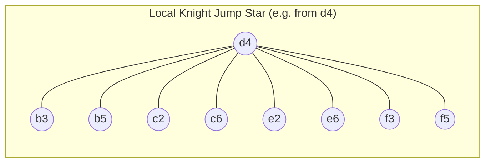
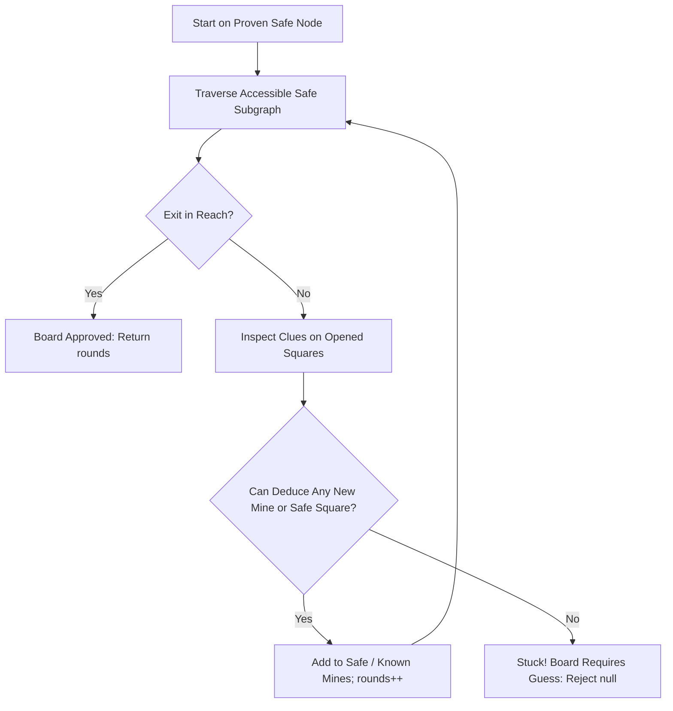

# Knightsweeper: A First-Principles Computer Science & Software Engineering Guide

Welcome to the technical learning guide for **Knightsweeper**.

This document is written for engineers who want to deeply understand the computer-science and software-engineering principles powering this game. Rather than treating code as arbitrary syntax, we build every concept from first principles: **What concrete problem are we facing, why does naive intuition break down, and what foundational computer-science concept solves it?**

Every section ties theory directly to the Knightsweeper codebase (`src/core/`, `src/components/`, `src/hooks/`).

---

## Table of Contents
1. [The 2D Grid Dilemma & Flat 1D Coordinate Mapping](#1-the-2d-grid-dilemma--flat-1d-coordinate-mapping)
2. [Movement Topology: Turning Chessboard Squares into Graphs](#2-movement-topology-turning-chessboard-squares-into-graphs)
3. [Adjacency Lists & Static Precomputation](#3-adjacency-lists--static-precomputation)
4. [Bipartite Graph Properties & Movement Invariants](#4-bipartite-graph-properties--movement-invariants)
5. [Breadth-First Search (BFS) & Shortest Path Distance Fields](#5-breadth-first-search-bfs--shortest-path-distance-fields)
6. [Clue Soundings as Linear Constraint Systems](#6-clue-soundings-as-linear-constraint-systems)
7. [Constraint Propagation & Single-Clue Deductive Solvers](#7-constraint-propagation--single-clue-deductive-solvers)
8. [Procedural Generation, Rejection Sampling & Fallback Easing](#8-procedural-generation-rejection-sampling--fallback-easing)
9. [Deterministic Pseudo-Randomness: Mulberry32 & Fisher-Yates](#9-deterministic-pseudo-randomness-mulberry32--fisher-yates)
10. [State Machines: Game Truth vs. Player Knowledge vs. UI State](#10-state-machines-game-truth-vs-player-knowledge-vs-ui-state)
11. [Modern React Architecture: Pure Reducers & Audio Event Streams](#11-modern-react-architecture-pure-reducers--audio-event-streams)

---

## 1. The 2D Grid Dilemma & Flat 1D Coordinate Mapping

### The Problem
A chessboard is visually a two-dimensional grid of 8 rows (ranks) and 8 columns (files). Naturally, our first instinct is to represent squares as coordinate pairs:
```typescript
interface Coord { row: number; col: number; }
const player = { row: 6, col: 1 }; // b2
```
However, in JavaScript and TypeScript, objects are compared by **reference identity**, not value:
```typescript
{ row: 6, col: 1 } !== { row: 6, col: 1 } // true! Different memory pointers
```
If we store opened squares or mine locations in a standard `Set<Coord>`, `set.has({ row: 6, col: 1 })` will **always return `false`** unless we pass the exact same object reference!
Turning coordinates into strings like `"6,1"` solves equality, but string concatenation and parsing inside game loops creates heavy garbage collection churn.

### The Computer Science Concept: 1D Array Flattening
Any two-dimensional array of dimensions $R \times C$ can be mapped bijectively onto a one-dimensional interval of integers $[0, R \cdot C - 1]$ using row-major indexing:
$$\text{key}(r, c) = r \cdot C + c$$
To reverse the operation and extract row and column from an index $k$:
$$r = \lfloor k / C \rfloor, \quad c = k \pmod C$$

### How Knightsweeper Implements It
In [`../src/core/coordinates.ts`](../src/core/coordinates.ts):
```typescript
export function key(r: number, c: number): SquareKey {
  return r * 8 + c;
}

export function rowOf(k: SquareKey): number {
  return Math.floor(k / 8);
}

export function colOf(k: SquareKey): number {
  return k % 8;
}
```
### Why This is Optimal
- **Primitive Value Comparison:** Integers are JavaScript primitives that compare strictly by value.
- **Instant Set Lookups:** `Set<number>.has(k)` operates in $O(1)$ time with zero object allocation.
- **Flat Memory Layout:** A single flat array of 64 elements occupies contiguous memory with zero nested pointer indirection.

---

## 2. Movement Topology: Turning Chessboard Squares into Graphs

### The Problem
A chess knight moves in an $L$-shape: two squares along one axis and one square along the perpendicular axis. From any given square, how does the game know where the knight can legally jump?

A naive approach would evaluate 8 vector additions every time the player hovers over a square:
$$(r \pm 1, c \pm 2) \quad \text{and} \quad (r \pm 2, c \pm 1)$$
followed by boundary checks $0 \le r < 8$ and $0 \le c < 8$. Doing this dynamically during pathfinding, clue calculation, and solver simulation results in tens of thousands of redundant boundary checks.

### The Computer Science Concept: Graph Modeling
In discrete mathematics, a **graph** $G = (V, E)$ consists of:
- A set of **vertices** (nodes) $V$, representing states or locations.
- A set of **edges** $E \subseteq V \times V$, representing valid transitions between vertices.

The 64 squares of a chessboard form the vertices $V = \{0, 1, \dots, 63\}$. The legal knight jumps between squares form undirected edges $(u, v) \in E$.



### Properties of the Knight Graph on an 8×8 Board:
- Total vertices: $|V| = 64$.
- Total directed edges: $|E| = 336$ (or 168 undirected edges).
- Minimum vertex degree: Corner squares (e.g. `a1`, `h8`) have degree 2.
- Maximum vertex degree: Central squares (e.g. `d4`, `e5`) have degree 8.

---

## 3. Adjacency Lists & Static Precomputation

### The Problem
How should we store the 336 edges of the knight graph in memory?
- An **Adjacency Matrix** would require a $64 \times 64$ boolean table (4,096 entries), where most entries are 0 (a sparse matrix).
- Calculating edges **on-demand** wastes CPU cycles.

### The Computer Science Concept: Adjacency List
An **Adjacency List** associates each vertex $v \in V$ with a list of its immediate neighbors $\text{Adj}[v]$. For a sparse graph where maximum degree is bounded ($\Delta(G) \le 8$), an adjacency list consumes only $O(|V| + |E|)$ space and allows iterating over all legal moves in $O(\text{deg}(v))$ time.

### How Knightsweeper Implements It
In [`../src/core/graph.ts`](../src/core/graph.ts), we compute the graph **once** at application startup:
```typescript
export const KNIGHT_GRAPH: ReadonlyArray<readonly SquareKey[]> = (() => {
  const table: SquareKey[][] = [];
  for (let k = 0; k < 64; k++) {
    const list: SquareKey[] = [];
    const r = rowOf(k);
    const c = colOf(k);
    for (const [dr, dc] of KNIGHT_JUMPS) {
      const nr = r + dr;
      const nc = c + dc;
      if (inBounds(nr, nc)) {
        list.push(key(nr, nc));
      }
    }
    table.push(list);
  }
  return table;
})();
```
### Result
Checking if a move from $A$ to $B$ is legal becomes a trivial lookup:
```typescript
KNIGHT_GRAPH[A].includes(B); // At most 8 integer comparisons
```

---

## 4. Bipartite Graph Properties & Movement Invariants

### The Problem
Why does the board alternate colors, and what mathematical guarantees does this provide for knight navigation?

### The Computer Science Concept: Bipartite Graphs
A graph $G = (V, E)$ is **bipartite** if its vertex set can be partitioned into two disjoint sets $V_1$ and $V_2$ such that every edge connects a vertex in $V_1$ to a vertex in $V_2$:
$$\forall (u, v) \in E, \quad u \in V_1 \implies v \in V_2$$
A fundamental theorem in graph theory states:
> *A graph is bipartite if and only if it contains no odd-length cycles.*

### How this Applies to Knightsweeper
Every knight jump changes the row by an odd amount ($\pm 1$ or $\pm 2$) and the column by an odd amount ($\pm 2$ or $\pm 1$). The sum of coordinates changes by an odd number:
$$\Delta r + \Delta c \equiv 1 \pmod 2$$
Therefore, **every knight move alternates between a light square and a dark square**.

```
Move 0 (Start): Light square
Move 1: Dark square
Move 2: Light square
...
```
**Key Invariant:** It is mathematically impossible for a knight to reach another square of the *same* color in an odd number of jumps. If the start is light and the exit is light, reaching the exit will always require an **even** number of moves!

---

## 5. Breadth-First Search (BFS) & Shortest Path Distance Fields

### The Problem
During board generation, Rule 1 mandates:
> *The exit must be at least 3 knight jumps away from the start square.*

How can we calculate the minimum number of knight jumps from the start square to every other square on the board?

### The Computer Science Concept: Unweighted Breadth-First Search (BFS)
Because every knight jump has equal weight (weight = 1), Dijkstra's algorithm is unnecessary. A standard **Breadth-First Search (BFS)** using a First-In-First-Out (FIFO) queue guarantees that vertices are visited in non-decreasing order of distance from the source.

### How Knightsweeper Implements It
In [`../src/core/graph.ts`](../src/core/graph.ts):
```typescript
export function jumpDistancesFrom(start: SquareKey): number[] {
  const dist = new Array<number>(64).fill(-1);
  dist[start] = 0;
  const queue: SquareKey[] = [start];

  while (queue.length > 0) {
    const current = queue.shift()!;
    const currentDist = dist[current];
    for (const next of KNIGHT_GRAPH[current]) {
      if (dist[next] < 0) {
        dist[next] = currentDist + 1;
        queue.push(next);
      }
    }
  }

  return dist;
}
```
### Algorithmic Complexity:
- **Time Complexity:** $O(|V| + |E|) = O(64 + 336) \approx 400$ operations, executing with negligible computational overhead on an 8×8 graph.
- **Space Complexity:** $O(|V|) = 64$ numbers.

---

## 6. Clue Numbers as Linear Constraint Systems

### The Problem
When the knight lands on a square, what does the clue number actually mean in terms of information theory?

### The Computer Science Concept: Boolean Linear Constraints
Assign each square $i \in [0..63]$ a binary variable:
$$x_i \in \{0, 1\}, \quad \text{where } x_i = 1 \iff \text{square } i \text{ contains a mine.}$$
When square $k$ is opened and reveals a clue number $C_k$, this defines a linear algebraic equation:
$$\sum_{j \in \text{Adj}[k]} x_j = C_k$$
Subject to:
$$x_j \in \{0, 1\}$$
For example, if square `d2` shows clue `1`, and its jump targets are $\{ b1, b3, c4, e4, f3, f1 \}$:
$$x_{b1} + x_{b3} + x_{c4} + x_{e4} + x_{f3} + x_{f1} = 1$$
Minesweeper is formally known to be **NP-complete** in the general case. However, human players do not solve general systems of equations using Gaussian elimination—they use local constraint propagation!

---

## 7. Constraint Propagation & Single-Clue Deductive Solvers

### The Problem
How can the game generate boards that can be solved purely through deductive logic, without forcing the player to guess?

### The Computer Science Concept: Constraint Satisfaction & Propagation
Let an opened square $q$ have clue $C_q$. Its neighbors $\text{Adj}[q]$ are partitioned into three disjoint sets:
1. $\text{KnownMines}(q) = \{ n \in \text{Adj}[q] \mid n \text{ is proven to be a mine} \}$
2. $\text{KnownSafe}(q) = \{ n \in \text{Adj}[q] \mid n \text{ is proven to be safe} \}$
3. $\text{Unknown}(q) = \text{Adj}[q] \setminus (\text{KnownMines}(q) \cup \text{KnownSafe}(q))$

The linear equation simplifies to:
$$|\text{KnownMines}(q)| + \sum_{u \in \text{Unknown}(q)} x_u = C_q$$
This produces two powerful deduction rules:

#### Deduction Rule 1: The All-Safe Rule
If the number of already identified mines equals the clue:
$$C_q = |\text{KnownMines}(q)| \implies \forall u \in \text{Unknown}(q), \quad x_u = 0 \quad (\text{Safe!})$$

#### Deduction Rule 2: The All-Mines Rule
If the remaining mines needed equals the count of unknown neighbors:
$$C_q - |\text{KnownMines}(q)| = |\text{Unknown}(q)| \implies \forall u \in \text{Unknown}(q), \quad x_u = 1 \quad (\text{Mine!})$$

### How Knightsweeper Implements It
In [`../src/core/solver.ts`](../src/core/solver.ts), the solver executes an alternating two-phase loop:
1. **Walk:** Traverse all reachable squares through proven `safe` nodes.
2. **Deduce:** If the exit is not reached and the knight is stuck, execute one round of Deduction Rules 1 & 2 across all opened squares.
3. If new safe squares or mines are discovered, increment `rounds` and repeat the walk. If no new deductions can be made, the board cannot be solved without guessing and is rejected!



---

## 8. Procedural Generation, Rejection Sampling & Fallback Easing

### The Problem
How do we generate levels that are guaranteed to have a logical solution?
If we try to build the board constructively (placing mines along paths to ensure a route), the resulting layouts often feel artificial, clustered, and predictable.

### The Computer Science Concept: Rejection Sampling
**Rejection Sampling** is a Monte Carlo technique:
1. Sample uniformly from the unconstrained space of random candidate placements.
2. Pass the candidate configuration through a verification predicate $\mathcal{P}(\text{board})$ (our deduction solver).
3. If $\mathcal{P}(\text{board}) == \text{true}$ and $\text{rounds} \ge 3$, accept the board. Otherwise, reject and resample.

### Why Fallback Easing is Necessary
Under tight constraints, rejection sampling can occasionally encounter a "difficult seed" where many candidate samples fail. To prevent infinite loops or UI freezing, we implement **adaptive relaxation (easing)**:
- After every 500 failed attempts, reduce the target mine count by 1.
- Impose a hard ceiling (`TRIES_HARD_CAP = 20000`).

In practice, with standard parameters, most candidate boards are accepted within tens of rejection sampling iterations, producing instant board setup in interactive play.

---

## 9. Deterministic Pseudo-Randomness: Mulberry32 & Fisher-Yates

### The Problem
How can two players on different computers play the exact same board using a simple 5-digit number like `54321`?

### The Computer Science Concept: Linear PRNG & Shuffling

#### Mulberry32 PRNG
A Pseudo-Random Number Generator takes an initial internal state (seed) and applies a deterministic recurrence relation:
$$S_{n+1} = f(S_n)$$
Mulberry32 generates pseudo-random 32-bit floating-point numbers using bit shifts and integer multiplications:
```typescript
export function mulberry32(seed: number): () => number {
  let a = seed >>> 0;
  return () => {
    a = (a + 0x6d2b79f5) | 0;
    let t = Math.imul(a ^ (a >>> 15), 1 | a);
    t = (t + Math.imul(t ^ (t >>> 7), 61 | t)) ^ t;
    return ((t ^ (t >>> 14)) >>> 0) / 4294967296;
  };
}
```

#### Fisher-Yates Modern Shuffle
To pick $M$ mines from $N$ candidate squares without replacement, we use the Fisher-Yates algorithm. It guarantees that all $N!$ permutations are equally likely in $O(N)$ time:
```typescript
export function shuffle<T>(array: T[], rng: () => number): T[] {
  for (let i = array.length - 1; i > 0; i--) {
    const j = Math.floor(rng() * (i + 1));
    [array[i], array[j]] = [array[j], array[i]];
  return array;
}
```

#### UX Abstraction: PRNG Seed vs. Battlefield Number
While computer scientists and engineers understand the mathematical concept of a seed, in the player-facing application this number is presented as **Battlefield #42817**. Players do not need to understand pseudo-random state machines to share or replay levels. Abstraction is a core software-engineering principle: present an intuitive, domain-relevant concept to users (a Battlefield Number) while utilizing a low-level mathematical primitive (a 32-bit PRNG seed) under the hood.

---

## 10. State Machines: Game Truth vs. Player Knowledge vs. UI State

### The Problem
One of the most common architectural flaws in puzzle games is mixing secret game data with player perception and rendering flags. This leads to accidental information leaks (e.g. rendering routines having access to unexploded mine coordinates) and impossible-to-debug state synchronizations.

### The Solution: The Four State Tiers

```
┌────────────────────────────────────────────────────────┐
│ 1. Secret Game Truth (Immutable during match)          │
│    - seed, difficulty, start, exit (Enemy King), mines │
├────────────────────────────────────────────────────────┤
│ 2. Player Knowledge (Fog of War)                       │
│    - opened Set, flags Set, hit Set                    │
├────────────────────────────────────────────────────────┤
│ 3. Runtime Progress                                    │
│    - pos, knights (lives), moves, status (playing/won) │
├────────────────────────────────────────────────────────┤
│ 4. Transient UI State                                  │
│    - flagMode toggle, hover key, pin key               │
└────────────────────────────────────────────────────────┘
```

The stationary destination node `exit` represents the **enemy King**. Reaching `exit` transitions the state to `'won'` (`KING CAPTURED`), whereas depleting both knights transitions to `'lost'` while the enemy King remains standing.

**The Information Leak Invariant:**
A component rendering an unopened square receives *only* whether the square is in `flags` or `legalSquares`. It never knows whether an unopened square contains a mine!

---

## 11. Modern React Architecture: Pure Reducers & Audio Event Streams

### The Problem
How do we trigger synthesized audio effects (chimes, detonations, victory arpeggios) without polluting our state transition logic with impure audio side effects?

### The Computer Science Concept: Pure State Reducers with Action-Event Streams
Instead of having state transitions directly call `audioContext.play()`, our reducer is a mathematical function that takes the current state and an action, and outputs a tuple of the new state and an array of domain events:
$$f(\text{State}, \text{Action}) \to (\text{NewState}, [\text{Event}_1, \text{Event}_2, \dots])$$

In [`../src/core/gameReducer.ts`](../src/core/gameReducer.ts):
```typescript
// When hitting a non-fatal mine:
return {
  state: {
    ...state,
    hit: nextHit,
    knights: nextKnights,
    moves: nextMoves,
  },
  soundEvents: [{ type: 'mine' }, { type: 'respawn' }],
};
```

### Why This is Great Software Engineering:
1. **100% Testable:** We can test in Vitest that jumping on a mine emits `[{ type: 'mine' }, { type: 'respawn' }]` without needing a mocked browser AudioContext.
2. **Deterministic Playback:** The React hook `useKnightsweeper` simply loops through `soundEvents` and passes them to the Web Audio engine.
3. **Zero Coupling:** If we later replace Web Audio with an HTML5 audio player or native mobile haptics, the game logic remains 100% untouched.

---

## Summary: How to Explain Knightsweeper in a Technical Interview

If asked about this project in an engineering interview, you can summarize its architectural depth in four concise points:

1. **Graph Representation:** *"Instead of treating the board as a 2D matrix, we modeled the 8×8 chessboard as a flattened 1D discrete graph with precomputed adjacency lists, converting move validation into constant-time array indexing."*
2. **Human-Centric Solver:** *"To guarantee that procedurally generated boards are fair and guess-free, we implemented a single-clue constraint propagation solver that models human deductive logic rather than brute-force backtracking."*
3. **Deterministic Procedural Generation:** *"We used Mulberry32 PRNG and Fisher-Yates shuffling inside a rejection sampling loop, ensuring that every board seed produces an identical, provably solvable puzzle."*
4. **Clean Architecture:** *"We separated domain rules into a pure TypeScript state machine that emits sound event streams, allowing comprehensive unit test coverage completely decoupled from React and browser APIs."*
